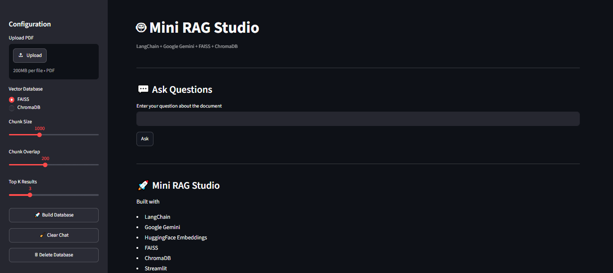
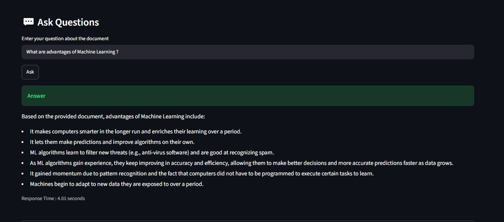
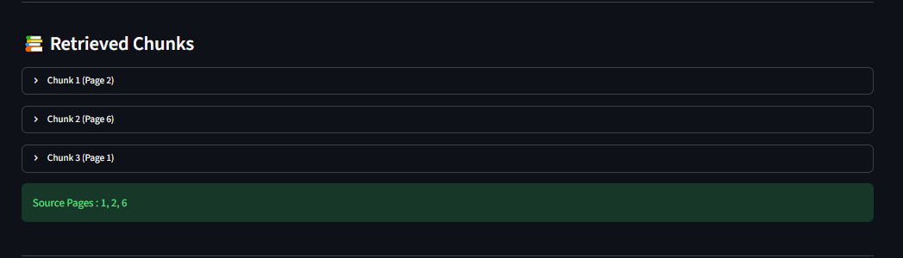

# 🚀 Mini RAG Studio

AI-powered PDF Question Answering using **Retrieval-Augmented Generation (RAG)**.

Mini RAG Studio allows users to upload PDF documents, build a vector database, and ask natural language questions. The application retrieves the most relevant document chunks and generates accurate, context-aware responses using Google Gemini.

---

## 📸 Screenshots

### 🏠 Homepage



### 💬 AI Generated Answer



### 📚 Retrieved Chunks



---

## ✨ Features

- 📄 Upload PDF documents
- 🧠 AI-powered Question Answering
- 🔍 Semantic Search using Embeddings
- 🗂️ Supports FAISS and ChromaDB
- ⚙️ Adjustable Chunk Size
- 🔄 Adjustable Chunk Overlap
- 🎯 Configurable Top-K Retrieval
- 📑 Source Page References
- 📚 Retrieved Chunk Visualization
- ⚡ Response Time Display
- 🧹 Clear Chat
- 🗑️ Delete Vector Database

---

## 🛠️ Tech Stack

| Technology | Purpose |
|------------|---------|
| Python | Programming Language |
| Streamlit | User Interface |
| LangChain | RAG Pipeline |
| Google Gemini | Large Language Model |
| FAISS | Vector Search |
| ChromaDB | Vector Database |
| PyPDF | PDF Processing |
| python-dotenv | Environment Variables |

---

## 🏗️ Project Architecture

```text
                User
                  │
                  ▼
            Upload PDF
                  │
                  ▼
             PDF Loader
                  │
                  ▼
          Text Chunking
                  │
                  ▼
      Generate Embeddings
                  │
                  ▼
      FAISS / ChromaDB
                  │
                  ▼
   Similarity Search (Top-K)
                  │
                  ▼
         Google Gemini
                  │
                  ▼
        Generated Answer
```

---

## 📂 Project Structure

```text
Mini-RAG-Studio/
│
├── app.py
├── requirements.txt
├── README.md
├── .gitignore
├── .env.example
│
├── assets/
│   ├── homepage.png
│   ├── answer-demo.png
│   └── retrieved-chunks.png
│
├── utils/
├── data/
└── database/
```

---

## ⚙️ Installation

Clone the repository

```bash
git clone https://github.com/YOUR_USERNAME/mini-rag-studio.git
```

Move into the project directory

```bash
cd mini-rag-studio
```

Install dependencies

```bash
pip install -r requirements.txt
```

Create a `.env` file

```env
GOOGLE_API_KEY=YOUR_API_KEY
```

Run the application

```bash
streamlit run app.py
```

---

## 🚀 Future Improvements

- Multi-PDF Support
- Chat History
- Conversation Memory
- OCR Support for Scanned PDFs
- Download Answers as PDF
- Similarity Score Display
- Metadata Filtering
- Streaming Responses

---

## 👩‍💻 Author

**Arpita Jaiswal**

M.Sc. Data Science Student

